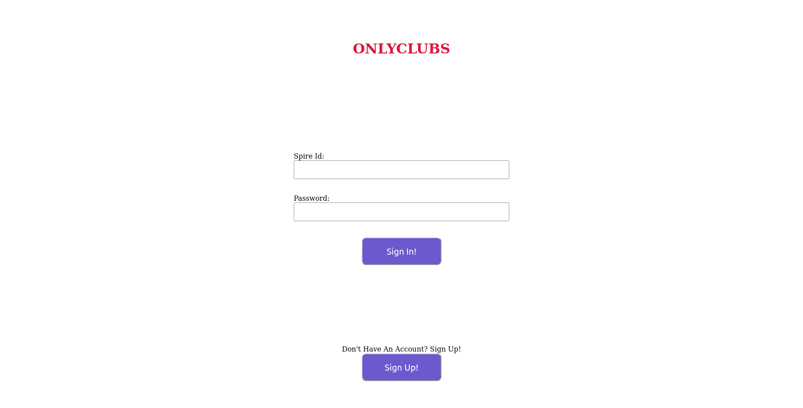
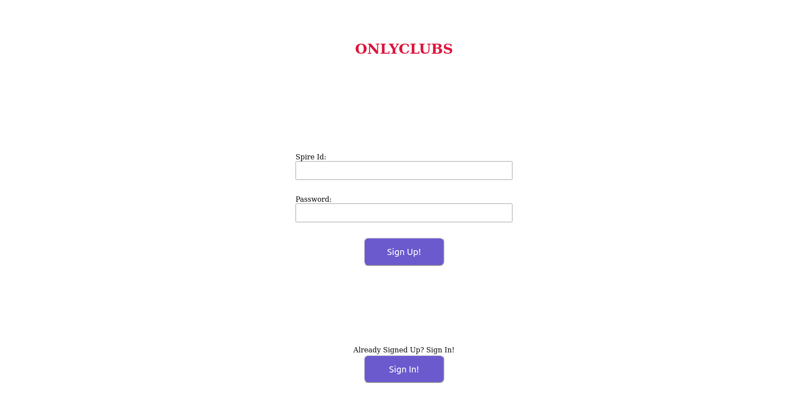
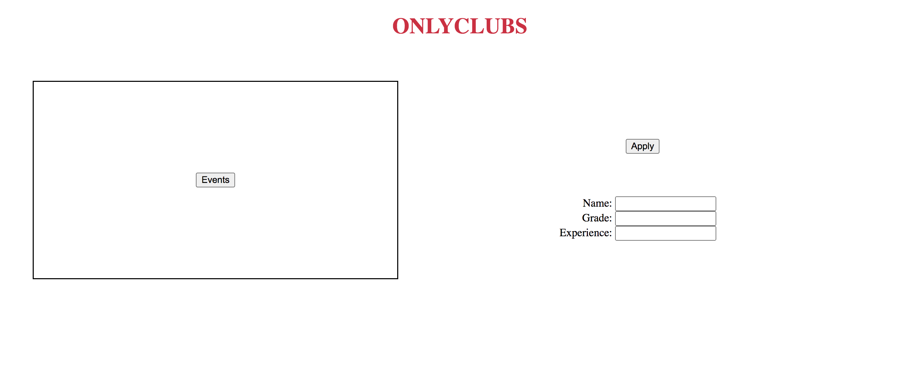
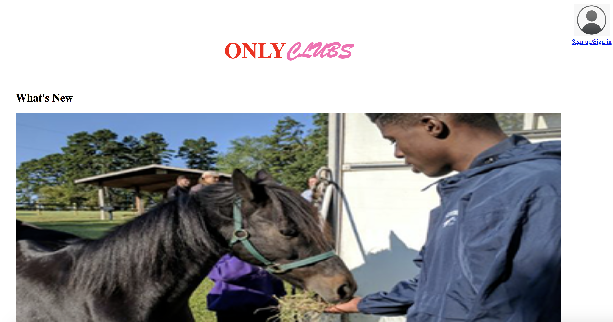
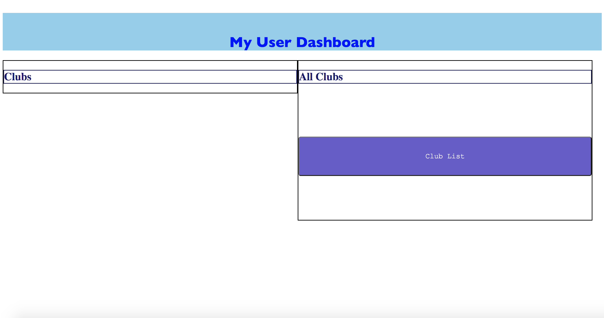

Title: ManILoveFullStack

Subtitle: OnlyClubs

Semester: Spring 2022

Overview: 
    Our application is a website for student clubs that allows students to sign up for clubs easily. There is a userDashboard that makes it so students can easily see the clubs they are involved in and a club list page where students can see all the clubs and choose to sign up for clubs that interest them. Our application is innovative since we found that CampusPulse is not that good for signing up for clubs because the interface is so user unfriendly. OnlyClubs is a better and more user friendly version of CampusPulse. 

Team Members:
    Yuval Shechter; YuvalShechter; https://github.com/YuvalShechter
    Natalie Ward; natward; https://github.com/natward
    Sebastian McKay; Sebastian-McKayy; https://github.com/Sebastian-McKayy
    Catherine Huang: Catherine-Huang: https://github.com/catherinehuang1 

User Interface: 
    
    The sign in page allows users to sign into their account by typing in their username and password, which is verified that it is a valid username password combination that has already been created and stored in the server. If someone doesn't have an account they can get redirected to the signup page using the "Don't have account" hyperlink.
    
    The sign up page allows a student to create an account using a new username and password that is then stored into the database. If someone already has an account they can get redirected to the signin page using the "already have account" hyperlink.
    
    This events page shows all the events that a specific club has in the future. It populates the page by getting the club name from the server and then using the club-events associated with the club and adding them in as HTML elements. 
    
    The club list page shows all the clubs that are in the database and populates them on the screen, allowing students to click on the individual clubs and redirect them to that clubs page. 
    
    The Club Page shows a specific club page with the HTML elements automatically generated from data stored in the server like the picture for the club, a video description of the club, and a place to apply and enter your information when joining the club. There is also a button that redirects the user to this club’s events page. 
    
    This title page shows an example image of a club. It also includes a description of the club at the bottom of the page. Additionally, it includes the sign in and sign up button at the top right of the screen which changes to the user page once the user has already logged in or their user/pass are stored in the local storage session.
    
    This page includes a list of all of the clubs that the user currently is a part of which allows them to explore each of the clubs when clicked. Additionally, it has a link to the clublist page (described above).
 
APIs:
"/add-fields": Adds either one friend or one club to the user’s array of clubs and friends
 
"/get-fields”: Returns all the fields in a user object–an array of their clubs, and an array of their friends
 
"/signin": Checks if your username and password exist and are valid to login. If they are, it logs you in and returns the account information
 
"/apply": Checks if you’re logged in–if you are, it adds the user to the club’s list of users, and will add the club to the user’s list of clubs
 
"/signup”: Lets you create a new account for the website
 
"/add-club": Lets you add a club with information (events list, president’s name, club image) to the club list
 
"/get-club": Gets the information of a club. Returns an empty object if there’s no information
 
"/get-events": Gets a list of all the events for a club
 
“/all-clubs” : Gets a list of all the club names 
 
Database:
Our database is a mongodb database controlled from heroku. It is a single database which includes two collections: accounts and clubs each of which contain information about their respective documents. Accounts has all of the account documents stored there and clubs has all of the club documents stored there. An account document is comprised of a username, a password, and club applications. A club document is comprised of the name, president’s name, an event list, a club image, a club video, a club description, and a list of club applications.
 
 
URL Routes/Mappings:
(Similar to API but with some more possible endpoints)
/calendar.html - This is the event list page
/club-list.html - This is the list of all clubs
/club-page.html - This is each specific club’s page
/index.html - This is the main page
/myUser.html - This is the user page which contains all of their clubs
/signin.html - This is the sign in page which lets the user log in
/signup.html - This is the sign up page which lets the user create an account
 
Authentication/Authorization:
Users are authenticated via a post request to the server which puts in their password and username as a document into the accounts collection. There is no hashing done on the password so it is just sent in plaintext for now and is compared to the currently stored password. Once you login and until you clear your localstorage you cannot access the sign in or sign up pages without using the back button on the browser, this is so that users don’t need to deal with unnecessary parts of the design flow.
 
Division of Labor:
Yuval Shechter - I made most of the backend server and the new connection to the mongodb database. I also helped with debugging the server and client side requests to the server. I also created the sign in and sign up pages and their functionality.
 
Natalie Ward - I created the event list and club list pages and implemented functions to dynamically render the database entries from server requests. I also implemented server communications for these two pages. I was in charge of deploying to Heroku and troubleshooting any issues we encountered. Additionally, I assisted Yuval with debugging server communications and helped with code cleanup.
 
Catherine Huang - (Catherine has the flu, so Nat is writing this)
Catherine created the club dashboard page and implemented server communications for that page. She set up the club page such that the club data can be injected into the page when accessed, and added the Events and Apply buttons to go to the Events list page and send the user’s data to the server when clicked. Additionally, she wrote the descriptions for API endpoints.
 
 
Sebastian McKay - I created the userDashboard and TitleScreen pages for the website and implemented the functions to dynamically populate these pages with information stored within the database of our server. I also assisted with creating the backend server and setting up the endpoints that allowed for communication between different pages. I also cleaned up the code and added the favicon. I also helped deploy to heroku for milestone 2, and tried to fix the errors encountered when deploying to heroku.
 
Conclusion:
This project was an interesting experience, it started with us barely knowing how to implement things in pure html/css/js to knowing how to run and deploy onto a real server online with several different js libraries such as express and morgan and using node js and using a third party database to host our site’s data. We found it difficult to put everything together even though separately it worked as intended, that is just because we had a lot of trouble actually deploying our code onto Heroku in the first place. It would have been nice to know that we will be using a different storage mechanism besides a plain JSON file ahead of time so we could have started with that, as it was: Yuval had to rewrite a lot of the database fetching code to accommodate for using a new form of database.

