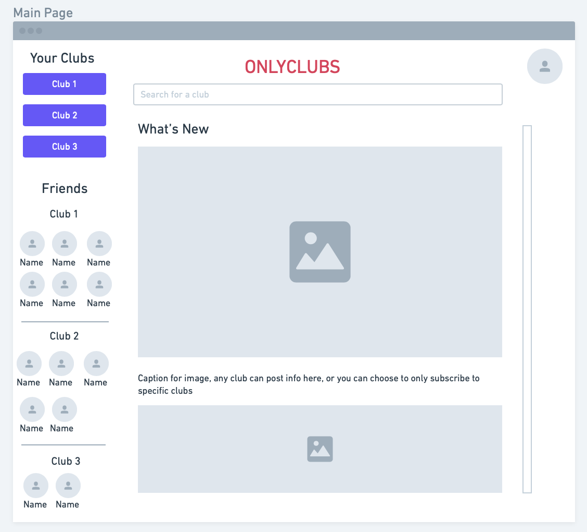
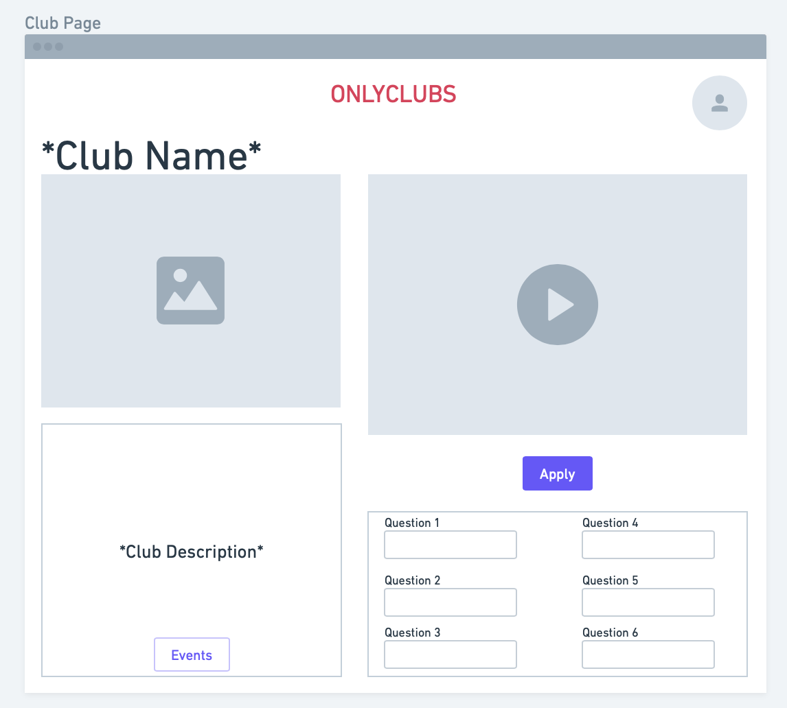
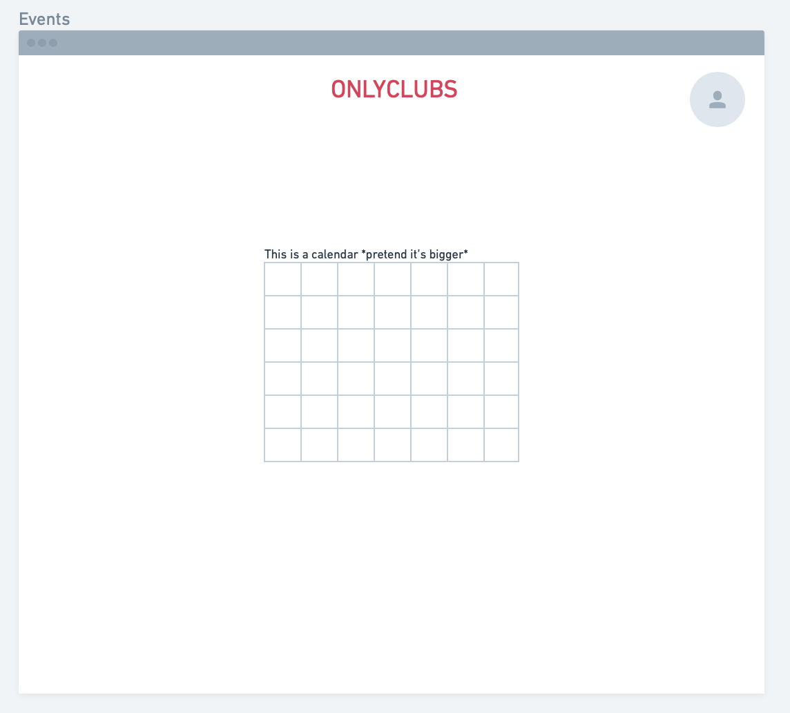

# Team Name

ManILoveFullStack

# Application Name

OnlyClubs

# Team Overview

* Yuval Shechter (@YuvalShechter)
* Catherine Huang (@catherinehuang1)
* Sebastian McKay (@Sebastian-McKayy)
* Natalie Ward (@natward)

# Innovative Idea

Our idea is a website for student clubs, with categories of interest that can be easily joined. Students can petition to create new categories with enough interest, and popular categories can petition to register as RSOs. Each category will have discussion boards and areas to share related content (videos, pictures, audio). This idea relates to the existing Campus Pulse application in that we hope to improve it and make clubs more accessible to new people.

# Important Data

Students create accounts with their Spire IDs to login. Once logged in, new users see a bunch of cards (with pictures) corresponding to clubs/interests and are prompted to select the ones that interest them. When a card is clicked, the club displays an “about us” video, and when a student is accepted, a little song plays. Users receive notifications when their club posts and for tryouts/auditions/meetings. Each club also has an “about us” section where they display important information such a calendar with schedules, meeting locations, etc.

# User Interface

## User Log In Page

<!-- ADD SCREENSHOTS TO THE IMAGES FOLDER -->

<!-- USER LOG IN SCREENSHOT HERE -->

Self explanatory :)

## User Dashboard

<!-- MAIN USER DASHBOARD SCREENSHOT HERE -->

This is the central hub each user is greeted with when they first log in. The sidebar contains a list of clubs the user has joined, and a list of friends organized by club membership. In the center of the page is a feed containing recent posts from each club. The user can customize their feed to decide what they see.

## Club Dashboard

<!-- CLUB DASHBOARD SCREENSHOT HERE, also can someone describe what the questions are in the wireframe idk what they're for-->

The club dashboard is the central hub for each club. Each club page contains an image and a video describing the club and introducing its leaders. Below that, there is a written description of the club with important information and a link to the club's calendar. There is also a button to apply to join the club.

## Event Calendar

The event calendar is specific to each club and contains any synchronous meetings, events, and activities related to the club.
