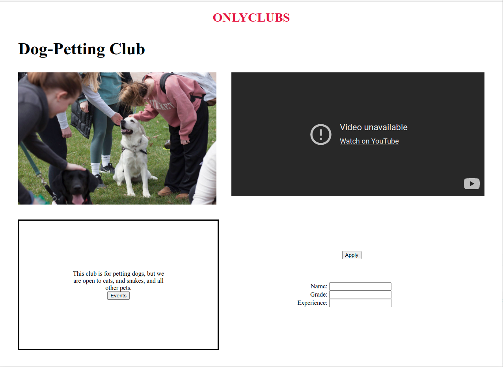

A brief and precise representation of APIs for you application

"/add-fields": Adds either one friend or one club to the user’s array of clubs and friends

"/get-fields”: Returns all the fields in a user object–an array of their clubs, and an array of their friends

"/signin": Checks if your username and password exist and are valid to login. If they are, it logs you in and returns the account information

"/apply": Checks if you’re logged in–if you are, it adds the user to the club’s list of users, and will add the club to the user’s list of clubs

"/signup”: Lets you create a new account for the website

"/add-club": Lets you add a club with information (events list, president’s name, club image) to the club list

"/get-club": Gets the information of a club. Returns an empty object if there’s no information

"/get-events": Gets a list of all the events for a club

“/all-clubs” : Gets a list of all the club names 

At least one set of four screenshots of your client interface with descriptions
The URL of your Heroku Application

Division of Labor Breakdown:

Natalie:
Updated the calendar structure to an event list, created the club list page, and implemented functions to dynamically render the database entries from server requests. Implemented server communications for both the calendar and club list pages. Valiantly attempted to deploy to Heroku :(

Catherine: 
Set up the club page such that the club data can be injected into the page when you access it.  Coded the Events and Apply buttons on the club page to go to the Events list page, and to send the user’s data to the server when clicked. Wrote descriptions for API endpoints.

Sebastian McKay:
Changed the title page to be cosmetic only and to be a portal to the signin/signup page and the user dashboard. Created the userDashboard page dynamically from server requests that generates the clubs a user belongs and displays it onto the page. Attempted valiantly to deploy heroku but to no avail no matter what method used heroku never connected to the GitHub.

Yuval valiantly made all of the express endpoints, all of the database helper functions, and tested all of them using postman on his local machine. He also implemented the signin.html and signup.html pages and merged everyone’s development branches together at the end.

# Club Page

# Sign Up Page

# Sign In Page

# Title Page

